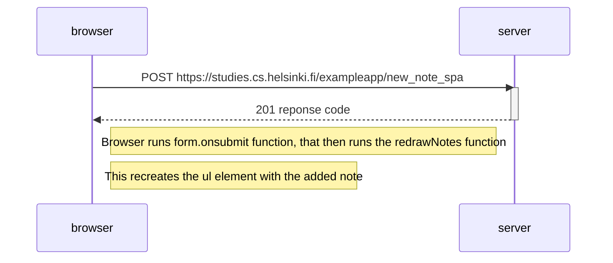

```mermaid
sequenceDiagram
    participant browser
    participant server

    browser->>server: POST https://studies.cs.helsinki.fi/exampleapp/new_note_spa
    activate server
    server-->>browser: 201 reponse code
    deactivate server
    
    Note right of browser: Browser runs form.onsubmit function, that then runs the redrawNotes function
    Note right of browser: This recreates the ul element with the added note
```